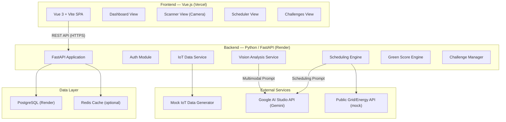
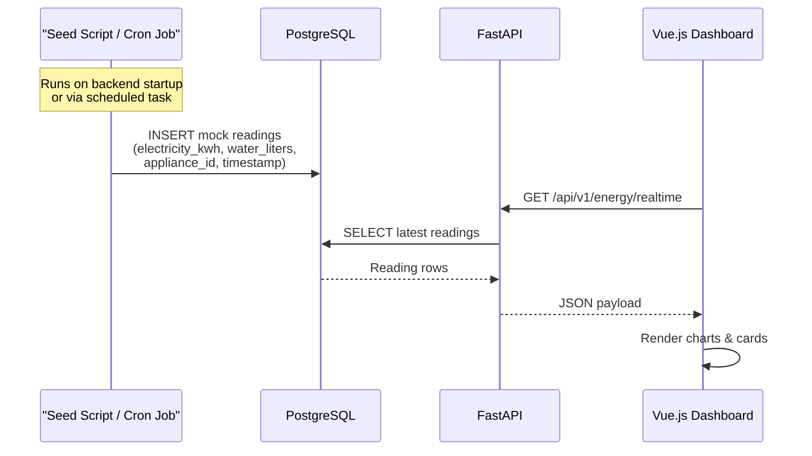
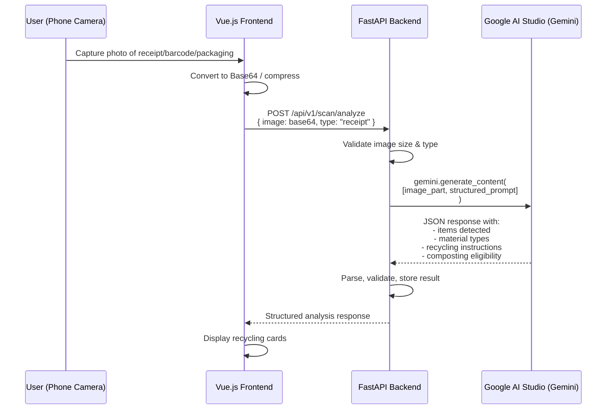
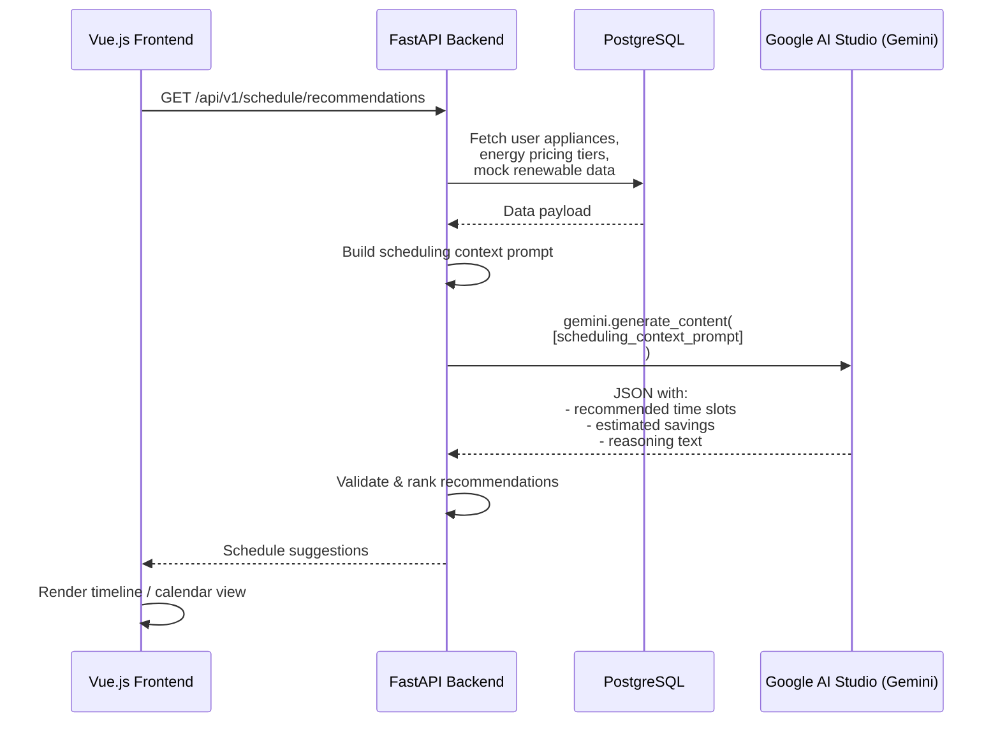
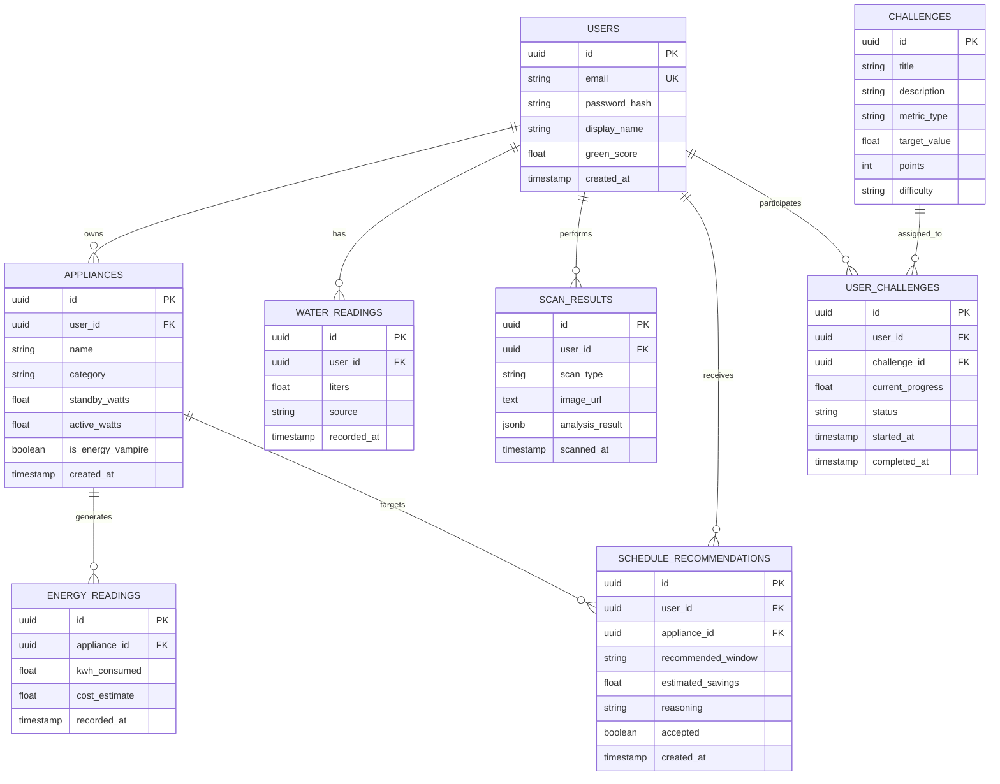

# 00 — General Thinking & System Architecture

> **EcoTrace AI** — An AI-Powered Sustainability Manager for Smart Homes

---

## 1. Executive Summary

EcoTrace AI is a web-based MVP that helps households **reduce their carbon footprint** and **lower utility bills** by leveraging AI-driven insights and smart home data. The system combines:

- **Mock IoT telemetry** (electricity meters, water monitors, appliance-level consumption) to surface "energy vampires" and usage patterns.
- **Visual recognition** via Google Gemini's multimodal capabilities to scan receipts, barcodes, and packaging for instant recycling/composting guidance.
- **Smart scheduling** that recommends optimal times to run heavy appliances based on grid demand, renewable energy peaks, and time-of-use pricing.
- **A personal dashboard** with a Green Score, CO₂ tracking, water savings, and gamified sustainability challenges.

The MVP targets a **single-household user** and prioritizes demonstrable end-to-end flows over production-grade scalability.

---

## 2. High-Level System Architecture



### Architecture Decisions

| Decision | Choice | Rationale |
|---|---|---|
| **Backend Language** | Python (FastAPI) | Native `google-generativeai` SDK, excellent async support, simpler AI integration than Laravel for this use case. |
| **Frontend Framework** | Vue 3 + Vite | As specified. Composition API + TypeScript for type safety. |
| **Database** | PostgreSQL | Free tier on Render. Relational model fits our structured data (users, devices, readings, challenges). |
| **AI Provider** | Google AI Studio (Gemini) | Free tier available, multimodal (text + image), sufficient for MVP volume. |
| **Auth Strategy** | JWT (stateless) | Simple, scales well, no session store needed. |
| **API Style** | REST (JSON) | Simpler than GraphQL for MVP scope. Versioned endpoints (`/api/v1/`). |

---

## 3. Tech Stack Summary

### Frontend
| Layer | Technology | Version |
|---|---|---|
| Framework | Vue 3 (Composition API) | 3.4+ |
| Build Tool | Vite | 5.x |
| State Management | Pinia | 2.x |
| Router | Vue Router | 4.x |
| HTTP Client | Axios | 1.x |
| Charts | Chart.js + vue-chartjs | 4.x |
| Camera/Scanner | `vue-web-cam` or native MediaStream API | — |
| CSS | SCSS Modules or UnoCSS | — |
| Hosting | Vercel | Free tier |

### Backend
| Layer | Technology | Version |
|---|---|---|
| Framework | FastAPI | 0.110+ |
| Python Version | 3.11+ | — |
| ORM | SQLAlchemy 2.0 + Alembic | — |
| AI SDK | `google-generativeai` | Latest |
| Auth | `python-jose` (JWT) + `passlib` (bcrypt) | — |
| Validation | Pydantic v2 | — |
| Task Queue | None (MVP) — consider Celery later | — |
| Hosting | Render (Web Service) | Free tier |
| Database | PostgreSQL | Render Free |

---

## 4. Data Flow Diagrams

### 4.1 Mock IoT Data Flow

Since real IoT devices are out of scope for the MVP, we simulate telemetry:



**Mock Data Strategy:**
- A Python seeder script generates **realistic time-series data** for 5–10 household appliances.
- Appliance profiles define base consumption, standby ("vampire") draw, and usage patterns.
- Data is generated with **15-minute intervals** covering the past 7–30 days.
- A dedicated endpoint can trigger "live" data injection to simulate real-time updates (SSE or polling).

### 4.2 Gemini API — Visual Recognition Flow



**Key Gemini Integration Notes:**
- Use `gemini-2.0-flash` model (free tier, fast, multimodal).
- Craft **structured prompts** that request JSON output with a defined schema.
- Implement **prompt templates** on the backend — never send raw user input directly.
- Add **rate limiting** to respect free tier quotas (~15 RPM, 1M tokens/day).
- Store analysis results in DB for caching (same barcode → cached result).

### 4.3 Gemini API — Smart Scheduling Flow



---

## 5. Database Schema Overview



---

## 6. API Design Principles

### Base URL Structure
```
Production:  https://ecotrace-api.onrender.com/api/v1/
Development: http://localhost:8000/api/v1/
```

### Endpoint Namespace Map

| Namespace | Purpose | Auth Required |
|---|---|---|
| `/auth/*` | Registration, login, token refresh | No (public) |
| `/users/*` | Profile, settings, green score | Yes |
| `/energy/*` | Electricity readings, appliance data, vampires | Yes |
| `/water/*` | Water usage readings | Yes |
| `/scan/*` | Image upload & analysis (Gemini) | Yes |
| `/schedule/*` | Scheduling recommendations (Gemini) | Yes |
| `/challenges/*` | Available & active challenges | Yes |
| `/dashboard/*` | Aggregated dashboard data | Yes |

### Standard Response Format
```json
{
  "success": true,
  "data": { ... },
  "meta": {
    "timestamp": "2026-06-08T00:30:00Z",
    "request_id": "uuid"
  }
}
```

### Error Response Format
```json
{
  "success": false,
  "error": {
    "code": "VALIDATION_ERROR",
    "message": "Human-readable message",
    "details": [ ... ]
  }
}
```

---

## 7. Deployment Roadmap (Beginner-Friendly)

### 7.1 Understanding the Stack

```
┌─────────────────────────────────────────────────────────┐
│                    USER'S BROWSER                        │
│                                                         │
│   Vue.js SPA loaded from Vercel                         │
│   Makes API calls to → Render backend                   │
└────────────────────────┬────────────────────────────────┘
                         │ HTTPS requests
                         ▼
┌─────────────────────────────────────────────────────────┐
│               VERCEL (Frontend Host)                     │
│                                                         │
│   • Serves the built Vue.js static files (HTML/JS/CSS)  │
│   • Free tier: 100 GB bandwidth/month                   │
│   • Auto-deploys from GitHub on every push              │
│   • URL: https://ecotrace.vercel.app                    │
└─────────────────────────────────────────────────────────┘

┌─────────────────────────────────────────────────────────┐
│               RENDER (Backend Host)                      │
│                                                         │
│   • Runs the FastAPI Python server                      │
│   • Free tier: 750 hours/month (spins down on idle)     │
│   • Also hosts PostgreSQL (free tier: 256 MB)           │
│   • URL: https://ecotrace-api.onrender.com              │
└─────────────────────────────────────────────────────────┘

┌─────────────────────────────────────────────────────────┐
│           GOOGLE AI STUDIO (Gemini API)                  │
│                                                         │
│   • Called by the backend (NEVER by the frontend)        │
│   • Free tier: 15 RPM, ~1500 requests/day               │
│   • API key stored as env variable on Render             │
└─────────────────────────────────────────────────────────┘
```

### 7.2 CORS (Cross-Origin Resource Sharing)

**What is CORS?**
When your Vue.js frontend at `https://ecotrace.vercel.app` makes an API call to `https://ecotrace-api.onrender.com`, the browser blocks this by default because the origins (domains) are different. CORS is the mechanism to explicitly allow this.

**How to configure (FastAPI):**
```
# In your main.py — add these CORS origins:
# - Your Vercel production URL
# - Your local dev URL (http://localhost:5173)
#
# FastAPI's CORSMiddleware handles this.
# Allow methods: GET, POST, PUT, DELETE, OPTIONS
# Allow headers: Content-Type, Authorization
# Allow credentials: true (for JWT in headers)
```

**Common CORS Mistakes to Avoid:**
- ❌ Setting `allow_origins=["*"]` in production (security risk).
- ❌ Forgetting to include `OPTIONS` in allowed methods (preflight fails).
- ❌ Not including `Authorization` in allowed headers (JWT breaks).

### 7.3 Securing API Keys

| Key | Where It Lives | How It's Accessed |
|---|---|---|
| `GEMINI_API_KEY` | Render environment variables | `os.environ["GEMINI_API_KEY"]` in Python |
| `JWT_SECRET_KEY` | Render environment variables | Used for signing/verifying tokens |
| `DATABASE_URL` | Render auto-injects | Connection string for PostgreSQL |

**Golden Rules:**
1. **NEVER** commit API keys to Git. Use `.env` files locally and `.gitignore` them.
2. **NEVER** call the Gemini API from the frontend. All AI calls go through your backend.
3. Use Render's **Environment Variables** panel (Dashboard → Service → Environment) to set secrets.
4. Rotate `JWT_SECRET_KEY` if it's ever exposed.

### 7.4 Deployment Steps (Abridged)

**Frontend (Vercel):**
1. Push your Vue.js project to a GitHub repo.
2. Sign up at [vercel.com](https://vercel.com) with your GitHub account.
3. Import the repo → Vercel auto-detects Vite.
4. Set the build command: `npm run build`.
5. Set the output directory: `dist`.
6. Add environment variable: `VITE_API_BASE_URL=https://ecotrace-api.onrender.com/api/v1`.
7. Deploy. Every push to `main` auto-deploys.

**Backend (Render):**
1. Push your FastAPI project to a GitHub repo (can be same repo, `/backend` folder).
2. Sign up at [render.com](https://render.com) (GitHub Student Pack gives you credits).
3. Create a **Web Service** → connect your repo.
4. Set build command: `pip install -r requirements.txt`.
5. Set start command: `uvicorn app.main:app --host 0.0.0.0 --port $PORT`.
6. Add environment variables: `GEMINI_API_KEY`, `JWT_SECRET_KEY`, `DATABASE_URL`.
7. Create a **PostgreSQL** instance → Render provides the connection string.
8. Deploy.

---

## 8. Development Phases Overview

| Phase | File | Focus | Estimated Effort |
|---|---|---|---|
| **Phase 1** | `01_project_setup_and_scaffolding.md` | Monorepo structure, Vue + FastAPI boilerplate, DB setup, CI basics | 2–3 days |
| **Phase 2** | `02_authentication_and_user_management.md` | Registration, login, JWT, user profile | 2 days |
| **Phase 3** | `03_dashboard_and_green_score.md` | Main dashboard UI, chart components, Green Score engine | 3–4 days |
| **Phase 4** | `04_iot_mock_data_and_energy_tracking.md` | Mock data seeder, appliance tracking, energy vampire detection | 3 days |
| **Phase 5** | `05_visual_recognition_gemini.md` | Camera integration, Gemini multimodal API, recycling results | 3–4 days |
| **Phase 6** | `06_smart_scheduling_engine.md` | Grid data mock, Gemini scheduling prompts, calendar UI | 3–4 days |
| **Phase 7** | `07_challenges_and_gamification.md` | Challenge system, progress tracking, points/rewards | 2–3 days |
| **Phase 8** | `08_deployment_and_ci_cd.md` | Vercel + Render deployment, environment configs, CI pipeline | 1–2 days |
| **Phase 9** | `09_testing_and_polish.md` | Unit tests, integration tests, UX polish, error handling | 2–3 days |

**Total Estimated MVP Timeline: 3–4 weeks** (solo developer, part-time ~4hrs/day)

---

## 9. Risk Register

| Risk | Impact | Mitigation |
|---|---|---|
| Gemini free tier rate limits hit during demo | High | Implement response caching, debounce requests, show cached fallbacks |
| Render free tier cold starts (30s+ delay) | Medium | Add loading states in UI, consider upgrading to paid tier for demo |
| Image uploads too large for free hosting | Medium | Compress images client-side before upload (target < 1 MB) |
| Scope creep beyond MVP | High | Strictly follow phase documents, defer "nice-to-haves" to post-MVP |
| PostgreSQL free tier 256 MB limit | Low | Implement data retention policy (keep only 30 days of readings) |

---

## 10. Conventions & Standards

- **Git Branching:** `main` (production) → `develop` (staging) → `feature/*` branches.
- **Commit Messages:** Conventional Commits (`feat:`, `fix:`, `docs:`, `chore:`).
- **API Versioning:** URL-based (`/api/v1/`).
- **Environment Files:** `.env.development`, `.env.production` — both in `.gitignore`.
- **Code Style:** `ruff` for Python, `eslint` + `prettier` for Vue/TypeScript.

---

> **Next:** Proceed to [01_project_setup_and_scaffolding.md](./01_project_setup_and_scaffolding.md) to set up the development environment and project structure.
