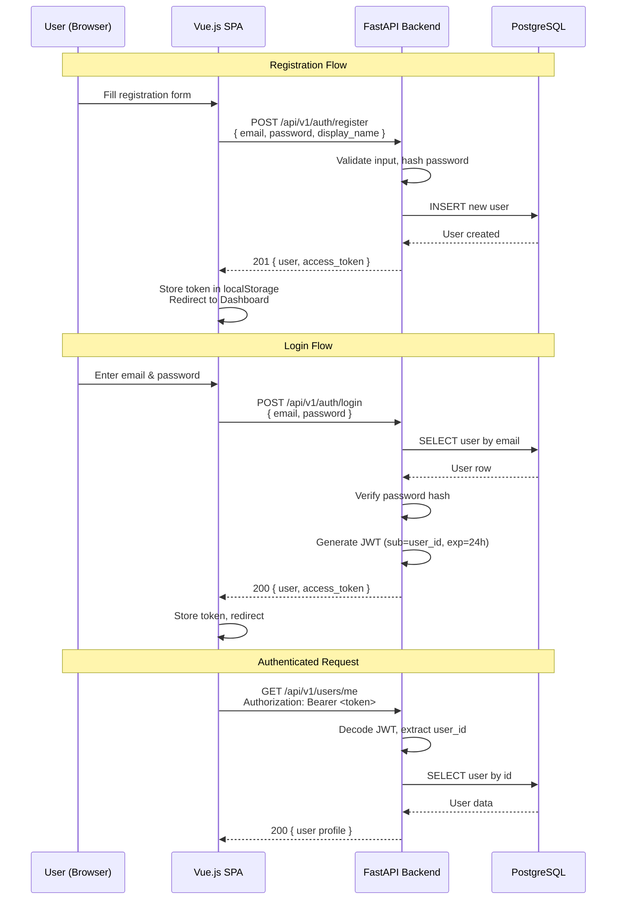

# 02 — Authentication & User Management

> **Phase 2** | Estimated Effort: 2 days
> **Goal:** Implement secure user registration, login, JWT-based authentication, and protected route middleware on both frontend and backend.

---

## 1. Objectives

- [ ] Build registration endpoint with email/password validation.
- [ ] Build login endpoint that returns JWT access tokens.
- [ ] Implement a `get_current_user` dependency for protected routes.
- [ ] Build user profile retrieval and update endpoints.
- [ ] Implement Vue.js auth store, login/register pages, and route guards.
- [ ] Add token refresh logic (optional for MVP, but plan for it).

---

## 2. Auth Flow Overview



---

## 3. Backend Implementation

### 3.1 API Endpoints

| Method | Endpoint | Auth | Request Body | Response |
|---|---|---|---|---|
| POST | `/api/v1/auth/register` | No | `{ email, password, display_name }` | `{ user, access_token }` |
| POST | `/api/v1/auth/login` | No | `{ email, password }` | `{ user, access_token }` |
| GET | `/api/v1/users/me` | Yes | — | `{ user profile }` |
| PUT | `/api/v1/users/me` | Yes | `{ display_name, ... }` | `{ updated user }` |
| POST | `/api/v1/auth/refresh` | Yes | — | `{ new access_token }` |

### 3.2 Pydantic Schemas

```
UserRegisterRequest:
  - email: EmailStr (required, validated)
  - password: str (required, min 8 chars, at least 1 digit)
  - display_name: str (required, 2–50 chars)

UserLoginRequest:
  - email: EmailStr
  - password: str

UserResponse:
  - id: UUID
  - email: str
  - display_name: str
  - green_score: float
  - created_at: datetime

AuthResponse:
  - user: UserResponse
  - access_token: str
  - token_type: str = "bearer"

UserUpdateRequest:
  - display_name: Optional[str]
```

### 3.3 Password Security

- Use `passlib` with **bcrypt** for password hashing.
- **Never** store plaintext passwords.
- Hash on registration, verify on login.
- Password requirements:
  - Minimum 8 characters.
  - At least one uppercase letter.
  - At least one digit.

### 3.4 JWT Token Structure

**Payload (Claims):**
```json
{
  "sub": "user-uuid-string",
  "exp": 1718000000,
  "iat": 1717913600,
  "type": "access"
}
```

**Configuration:**
- Algorithm: `HS256`
- Expiry: 24 hours (configurable via `JWT_EXPIRY_MINUTES`)
- Signed with `JWT_SECRET_KEY` from environment

### 3.5 `get_current_user` Dependency

This is a FastAPI dependency that:
1. Extracts the `Authorization: Bearer <token>` header.
2. Decodes the JWT using `python-jose`.
3. Extracts the `sub` (user ID) claim.
4. Queries the database for the user.
5. Returns the user object or raises `HTTPException(401)`.

Use this dependency on all protected endpoints:
```
@router.get("/me")
async def get_profile(current_user: User = Depends(get_current_user)):
    return current_user
```

### 3.6 Security Utilities (`app/utils/security.py`)

Functions to implement:
| Function | Purpose |
|---|---|
| `hash_password(plain: str) → str` | Bcrypt hash |
| `verify_password(plain: str, hashed: str) → bool` | Bcrypt verify |
| `create_access_token(data: dict) → str` | Create JWT with expiry |
| `decode_access_token(token: str) → dict` | Decode and validate JWT |

---

## 4. Frontend Implementation

### 4.1 Auth Store (Pinia)

`stores/auth.ts` should manage:

| State | Type | Description |
|---|---|---|
| `user` | `User \| null` | Current logged-in user |
| `token` | `string \| null` | JWT access token |
| `isAuthenticated` | `computed<boolean>` | Derived from `token !== null` |
| `isLoading` | `boolean` | Loading state for auth operations |
| `error` | `string \| null` | Last error message |

**Actions:**
| Action | Description |
|---|---|
| `register(data)` | POST to `/auth/register`, store token + user |
| `login(data)` | POST to `/auth/login`, store token + user |
| `logout()` | Clear token + user, redirect to login |
| `fetchUser()` | GET `/users/me`, refresh user data |
| `initialize()` | On app load, check localStorage for token, validate it |

**Token Persistence:**
- Store the JWT in `localStorage` under key `ecotrace_token`.
- On app initialization, read the token and call `fetchUser()` to validate.
- If `fetchUser()` returns 401, clear the token and redirect to login.

### 4.2 Vue Router Guards

```
router.beforeEach((to, from, next) => {
  const authStore = useAuthStore()
  const requiresAuth = to.meta.requiresAuth

  if (requiresAuth && !authStore.isAuthenticated) {
    next({ name: 'Login', query: { redirect: to.fullPath } })
  } else if (to.name === 'Login' && authStore.isAuthenticated) {
    next({ name: 'Dashboard' })
  } else {
    next()
  }
})
```

**Route Configuration:**
| Route | Component | Auth Required |
|---|---|---|
| `/login` | `LoginPage.vue` | No |
| `/register` | `RegisterPage.vue` | No |
| `/dashboard` | `DashboardPage.vue` | Yes |
| `/scanner` | `ScannerPage.vue` | Yes |
| `/scheduler` | `SchedulerPage.vue` | Yes |
| `/challenges` | `ChallengesPage.vue` | Yes |

### 4.3 Login Page Requirements

- **Fields:** Email input, Password input (with show/hide toggle).
- **Validation:** Client-side validation before API call (email format, password length).
- **UX:** Loading spinner on submit, error toast on failure, success redirect.
- **Link:** "Don't have an account? Register" link to registration page.

### 4.4 Registration Page Requirements

- **Fields:** Display Name, Email, Password, Confirm Password.
- **Validation:**
  - Display name: 2–50 characters.
  - Email: valid email format.
  - Password: 8+ chars, 1 digit, 1 uppercase.
  - Confirm password: must match password.
- **UX:** Real-time validation feedback, loading state, error handling.
- **Link:** "Already have an account? Log in" link.

### 4.5 Axios Interceptors

**Request Interceptor:**
```
// Attach token to every request
api.interceptors.request.use(config => {
  const token = localStorage.getItem('ecotrace_token')
  if (token) {
    config.headers.Authorization = `Bearer ${token}`
  }
  return config
})
```

**Response Interceptor:**
```
// Handle 401 globally
api.interceptors.response.use(
  response => response,
  error => {
    if (error.response?.status === 401) {
      // Clear auth state, redirect to login
      const authStore = useAuthStore()
      authStore.logout()
    }
    return Promise.reject(error)
  }
)
```

---

## 5. Edge Cases & Error Handling

| Scenario | Backend Response | Frontend Handling |
|---|---|---|
| Duplicate email registration | 409 Conflict: "Email already registered" | Show error message, don't clear form |
| Invalid email format | 422 Validation Error | Show field-level error |
| Wrong password on login | 401 Unauthorized: "Invalid credentials" | Generic error (don't reveal if email exists) |
| Expired JWT token | 401 Unauthorized | Interceptor clears auth, redirects to login |
| Malformed JWT token | 401 Unauthorized | Same as expired |
| Missing Authorization header | 401 Unauthorized | Redirect to login |
| Password too weak | 422 Validation Error | Show password requirements |
| Network error | No response | Show "Connection error, please try again" |

### Security Considerations

- **Don't reveal** whether an email exists during login failures. Use a generic "Invalid credentials" message.
- **Rate limit** login attempts: 5 attempts per minute per IP (use `slowapi` or custom middleware).
- **Sanitize** all user inputs on the backend even though Pydantic handles validation.
- **HTTPS only** in production — Vercel and Render both enforce this by default.

---

## 6. Testing Checklist

| Test Case | Method |
|---|---|
| Register with valid data → 201 + token | `pytest` + `httpx` |
| Register with existing email → 409 | `pytest` |
| Login with correct credentials → 200 + token | `pytest` |
| Login with wrong password → 401 | `pytest` |
| Access protected route with valid token → 200 | `pytest` |
| Access protected route without token → 401 | `pytest` |
| Access protected route with expired token → 401 | `pytest` |
| Frontend login flow → redirects to dashboard | Manual / E2E |
| Frontend register flow → redirects to dashboard | Manual / E2E |
| Frontend logout → redirects to login, clears token | Manual / E2E |

---

## 7. Dependencies on Other Phases

| Dependency | Direction |
|---|---|
| **Phase 1** (Setup) | ← Must be complete before starting auth |
| **Phase 3** (Dashboard) | → Dashboard requires authenticated user context |
| **Phase 4+** (All features) | → All API calls require JWT authentication |

---

> **Next:** Proceed to [03_dashboard_and_green_score.md](./03_dashboard_and_green_score.md) to build the main dashboard interface and Green Score engine.
