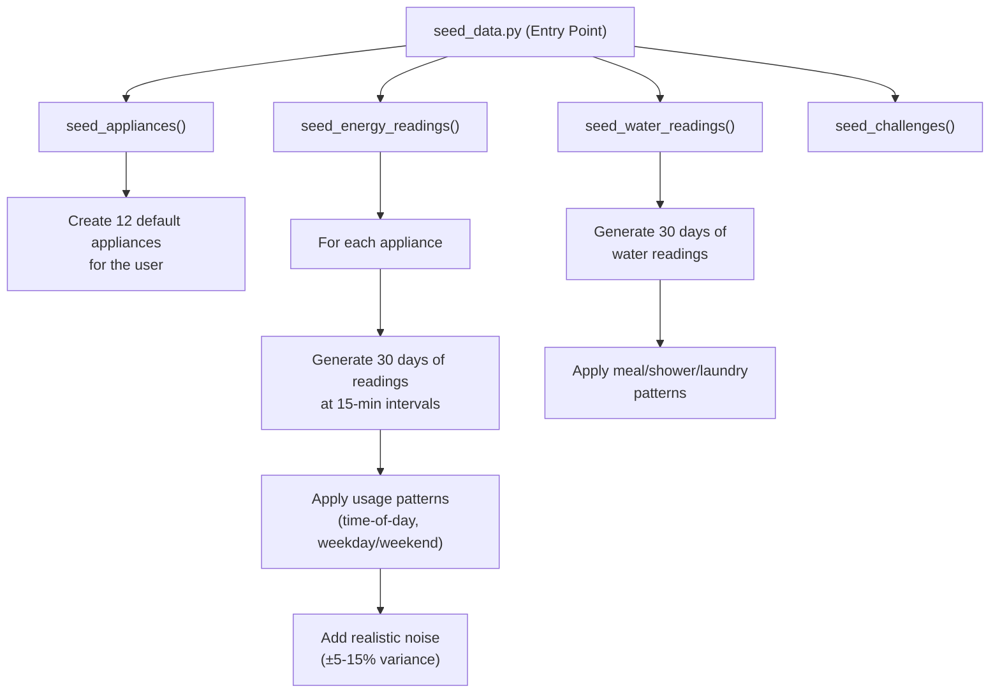

# 04 — IoT Mock Data & Energy Tracking

> **Phase 4** | Estimated Effort: 3 days
> **Goal:** Build the mock IoT data generation system, appliance management, energy/water reading APIs, and the "energy vampire" detection engine.

---

## 1. Objectives

- [ ] Create realistic appliance profiles for a typical household.
- [ ] Build a data seeder that generates time-series energy and water readings.
- [ ] Implement CRUD APIs for appliance management.
- [ ] Implement energy and water reading retrieval with filtering and aggregation.
- [ ] Build the energy vampire detection algorithm.
- [ ] Add a "live simulation" mode for demo purposes.

---

## 2. Appliance Profiles

### 2.1 Default Household Appliances

The seeder creates these default appliances for each new user:

| Appliance | Category | Active Watts | Standby Watts | Avg Daily Use (hrs) | Is Vampire? |
|---|---|---|---|---|---|
| Refrigerator | Kitchen | 150 | 2 | 24 (always on) | No |
| Washing Machine | Laundry | 500 | 5 | 1 | Yes |
| Clothes Dryer | Laundry | 3000 | 3 | 0.5 | No |
| Dishwasher | Kitchen | 1800 | 4 | 1 | No |
| Television (55") | Entertainment | 100 | 12 | 5 | Yes |
| Gaming Console | Entertainment | 200 | 15 | 2 | Yes |
| Desktop Computer | Office | 300 | 8 | 6 | Yes |
| Microwave | Kitchen | 1200 | 3 | 0.25 | No |
| Air Conditioner | HVAC | 3500 | 0 | 8 (seasonal) | No |
| Water Heater | Utility | 4500 | 0 | 3 | No |
| Smart Speaker | Entertainment | 6 | 4 | 24 | Yes |
| Cable/Satellite Box | Entertainment | 35 | 26 | 6 | Yes |

### 2.2 Appliance Data Model

```
Appliance:
  id: UUID (PK)
  user_id: UUID (FK → users)
  name: str
  category: enum ["kitchen", "laundry", "entertainment", "office", "hvac", "utility", "other"]
  icon: str (emoji or icon name)
  active_watts: float
  standby_watts: float
  avg_daily_hours: float
  is_energy_vampire: bool (computed: standby_watts > 5)
  is_active: bool (user can mark as inactive)
  created_at: datetime
  updated_at: datetime
```

---

## 3. Mock Data Generation

### 3.1 Data Seeder Architecture



### 3.2 Realistic Usage Patterns

Energy data should **not** be flat or random. It must follow realistic daily patterns:

**Time-of-Day Multipliers:**
```
Hour 0-5:   0.3  (sleeping — only fridge, standby)
Hour 6-8:   0.7  (morning routine — water heater, lights)
Hour 9-11:  0.5  (daytime — most people at work)
Hour 12-13: 0.6  (lunch — microwave, AC)
Hour 14-16: 0.5  (afternoon)
Hour 17-19: 0.9  (evening — cooking, TV, AC)
Hour 20-22: 0.8  (entertainment peak — TV, gaming, computer)
Hour 23:    0.4  (winding down)
```

**Weekday vs. Weekend Modifiers:**
- Weekdays: Apply the pattern above.
- Weekends: Shift morning activity later (+2 hours), increase entertainment usage by 40%.

**Seasonal Variation (Optional for MVP):**
- Summer: AC usage doubles.
- Winter: Water heater usage increases.

### 3.3 Energy Reading Data Model

```
EnergyReading:
  id: UUID (PK)
  appliance_id: UUID (FK → appliances)
  kwh_consumed: float
  is_standby: bool (whether the reading is during standby)
  cost_estimate: float (kwh × rate)
  recorded_at: datetime (15-min intervals)
```

**Generation Formula (per 15-min interval):**
```
if appliance is active during this time slot:
    kwh = (active_watts / 1000) × 0.25 hours × time_multiplier × random(0.85, 1.15)
else:
    kwh = (standby_watts / 1000) × 0.25 hours × random(0.9, 1.1)

cost = kwh × rate_per_kwh  # Default: $0.12/kWh
```

### 3.4 Water Reading Data Model

```
WaterReading:
  id: UUID (PK)
  user_id: UUID (FK → users)
  liters: float
  source: enum ["shower", "faucet", "toilet", "washing_machine", "dishwasher", "irrigation", "other"]
  recorded_at: datetime
```

**Water Usage Patterns (daily totals):**
| Source | Average Daily Liters | Time Pattern |
|---|---|---|
| Shower | 65 (2 showers × 8 min × 9.5 L/min ÷ 2.5 efficiency) | Morning 6–8 AM, Evening 9–10 PM |
| Toilet | 48 (8 flushes × 6L) | Spread throughout waking hours |
| Faucet | 45 (cooking, hand washing) | Peaks around meals |
| Washing Machine | 50 (if laundry day, else 0) | 2–3 days per week |
| Dishwasher | 22 (if used, else 0) | Evening after dinner |
| Irrigation | 0-40 (seasonal, 2-3 days/week) | Morning 6–7 AM |

---

## 4. API Endpoints

### 4.1 Appliance Management

| Method | Endpoint | Purpose |
|---|---|---|
| GET | `/api/v1/energy/appliances` | List all user's appliances |
| GET | `/api/v1/energy/appliances/{id}` | Get single appliance details |
| POST | `/api/v1/energy/appliances` | Add a custom appliance |
| PUT | `/api/v1/energy/appliances/{id}` | Update appliance info |
| DELETE | `/api/v1/energy/appliances/{id}` | Remove an appliance |

### 4.2 Energy Readings

| Method | Endpoint | Purpose |
|---|---|---|
| GET | `/api/v1/energy/readings?range=today\|7d\|30d` | Aggregated energy readings |
| GET | `/api/v1/energy/readings/{appliance_id}?range=7d` | Readings for a specific appliance |
| GET | `/api/v1/energy/realtime` | Latest readings (simulated real-time) |
| GET | `/api/v1/energy/vampires` | List energy vampires with yearly cost |

### 4.3 Water Readings

| Method | Endpoint | Purpose |
|---|---|---|
| GET | `/api/v1/water/readings?range=today\|7d\|30d` | Aggregated water readings |
| GET | `/api/v1/water/readings/by-source` | Breakdown by source (shower, faucet, etc.) |

---

## 5. Energy Vampire Detection

### 5.1 Detection Algorithm

```
For each appliance:
    1. Calculate standby_hours = 24 - avg_daily_hours
    2. Calculate standby_kwh_daily = (standby_watts / 1000) × standby_hours
    3. Calculate standby_cost_yearly = standby_kwh_daily × 365 × rate_per_kwh

    If standby_watts > 5 AND standby_cost_yearly > $5:
        → Flag as energy vampire
        → Calculate potential savings if unplugged during standby
```

### 5.2 Vampire Response Schema

```
EnergyVampire:
  appliance_id: UUID
  appliance_name: str
  category: str
  standby_watts: float
  standby_hours_per_day: float
  daily_vampire_kwh: float
  yearly_vampire_cost: float
  suggestion: str  # Actionable recommendation
  is_resolved: bool
```

### 5.3 Suggestion Templates

| Vampire Category | Suggestion |
|---|---|
| Entertainment (TV, Gaming) | "Connect to a smart power strip that cuts power when the main device is off." |
| Office (Computer) | "Enable sleep mode after 10 minutes of inactivity, or use a power strip with a master switch." |
| Kitchen (Microwave) | "The standby draw is minimal, but you can unplug when going on vacation." |
| Charging Devices | "Unplug chargers when not in use — they draw power even without a device connected." |

---

## 6. Live Simulation Mode

For demo purposes, implement a "live data injection" mechanism:

### 6.1 Approach: SSE (Server-Sent Events) or Polling

**Option A: Polling (Simpler, recommended for MVP)**
- Frontend polls `GET /api/v1/energy/realtime` every 30 seconds.
- Backend returns the latest reading and a "total watts now" aggregation.
- Backend periodically generates new readings (e.g., every minute via a background task or on-demand).

**Option B: SSE (More realistic)**
- Backend exposes `GET /api/v1/energy/stream` as an SSE endpoint.
- Sends a new reading event every 15 seconds.
- Frontend uses `EventSource` to listen.

### 6.2 Real-Time Response Schema

```
RealtimeEnergy:
  timestamp: datetime
  total_watts_now: float
  total_kwh_today: float
  active_appliances: int
  readings: [
    { appliance_name: str, watts: float, status: "active" | "standby" | "off" }
  ]
```

---

## 7. Aggregation Queries

### 7.1 Key Aggregations (Backend SQL/ORM)

| Query | SQL Logic |
|---|---|
| Total kWh today | `SUM(kwh_consumed) WHERE recorded_at >= today_start` |
| Daily totals for 7 days | `GROUP BY DATE(recorded_at) ORDER BY date DESC LIMIT 7` |
| By appliance (pie chart) | `GROUP BY appliance_id, SUM(kwh_consumed)` |
| Peak usage hour | `GROUP BY HOUR(recorded_at), find MAX(SUM(kwh))` |
| Vampire cost per device | `SUM(kwh_consumed) WHERE is_standby = true GROUP BY appliance_id` |

### 7.2 Performance Considerations

- For 12 appliances × 30 days × 96 intervals/day = **34,560 rows** — manageable for PostgreSQL.
- Add **indexes** on: `appliance_id`, `recorded_at`, and composite `(appliance_id, recorded_at)`.
- For the dashboard, precompute daily aggregates into a `daily_summaries` table to avoid expensive queries on every page load.

---

## 8. Frontend Components

### 8.1 Appliance Management UI

- **Appliance List View:** Grid of appliance cards showing name, icon, category, current status (active/standby), and daily kWh.
- **Add Appliance Modal:** Form to add custom appliances with name, category, wattage fields.
- **Appliance Detail View:** Drill-down showing a single appliance's usage over time (line chart).

### 8.2 Real-Time Monitor Widget

- A compact widget on the dashboard showing:
  - Current total watts
  - Animated power meter (needle gauge or bar)
  - List of currently active appliances with their wattage
  - Updates every 30 seconds (polling)

---

## 9. Edge Cases

| Scenario | Handling |
|---|---|
| User has no appliances yet | Show "Add your first appliance" onboarding card |
| Seeder run twice | Check for existing data, skip if already seeded (idempotent) |
| Very long time range query (90d) | Paginate or use daily aggregates instead of raw readings |
| Appliance deleted but has readings | Soft-delete appliance, keep readings for historical data |
| Real-time endpoint called too frequently | Rate limit to 1 request per 10 seconds per user |
| Mock data timestamps vs. user timezone | Store all timestamps in UTC, convert on the frontend |

---

## 10. Testing Checklist

| Test | Method |
|---|---|
| Seeder creates correct number of appliances | Unit test |
| Seeder generates readings with realistic variance | Unit test (check range bounds) |
| Energy vampire detection flags correct devices | Unit test |
| Aggregation queries return correct totals | Integration test |
| Appliance CRUD operations work | API test |
| Real-time endpoint returns latest data | API test |
| Charts render with seeded data | Manual verification |

---

## 11. Dependencies

| Dependency | Direction |
|---|---|
| **Phase 1** (Setup) | ← Database and project structure must exist |
| **Phase 2** (Auth) | ← Appliances are user-scoped, require auth |
| **Phase 3** (Dashboard) | → Dashboard consumes the data generated here |
| **Phase 6** (Scheduling) | → Scheduling uses appliance data for recommendations |

---

> **Next:** Proceed to [05_visual_recognition_gemini.md](./05_visual_recognition_gemini.md) to integrate Google Gemini for receipt/barcode scanning and recycling guidance.
