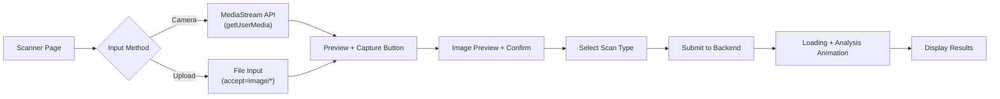
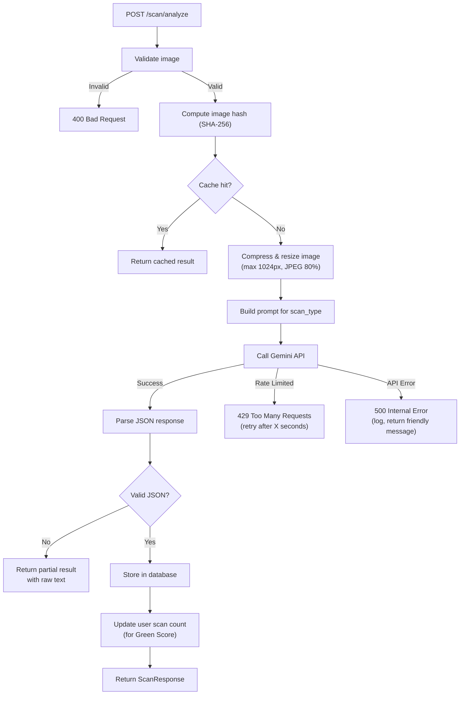

# 05 — Visual Recognition & Waste Management (Gemini)

> **Phase 5** | Estimated Effort: 3–4 days
> **Goal:** Integrate Google Gemini's multimodal API to enable users to scan grocery receipts, product barcodes, and packaging materials for instant recycling/composting instructions.

---

## 1. Objectives

- [ ] Implement camera capture/upload functionality in the Vue.js frontend.
- [ ] Build the Gemini multimodal integration service on the backend.
- [ ] Design structured prompts for three scan types: receipt, barcode, packaging.
- [ ] Implement response parsing and result caching.
- [ ] Create the scan results UI with actionable recycling/composting cards.
- [ ] Add rate limiting and error handling for the Gemini API.

---

## 2. Scan Types & Use Cases

| Scan Type | User Action | What Gemini Analyzes | Output |
|---|---|---|---|
| **Receipt** | Photo of grocery receipt | Items purchased, store, date | Recycling instructions per item, sustainability score for the shopping trip |
| **Barcode** | Photo of product barcode/label | Product identification, packaging type | Material breakdown, recycling bin color, composting eligibility |
| **Packaging** | Photo of packaging material | Material type (plastic, cardboard, glass, etc.) | Recycling category, local disposal instructions, environmental impact |

---

## 3. Frontend: Scanner Page

### 3.1 Camera Integration



### 3.2 Camera Component Requirements

**`ScannerCapture.vue`:**
- **Two input modes:** Live camera feed OR file upload (for desktop users).
- **Camera:** Use `navigator.mediaDevices.getUserMedia({ video: { facingMode: 'environment' } })` for rear camera on mobile.
- **Preview:** Show captured image before submitting for analysis.
- **Compression:** Resize images to max 1024px width and compress to JPEG quality 0.8 before upload (keeps under 500KB typically).
- **Scan type selector:** Three buttons/tabs — Receipt, Barcode, Packaging.
- **Permission handling:** Gracefully handle camera permission denial with fallback to file upload.

### 3.3 Scanner Page Layout

```
┌──────────────────────────────────────────┐
│  📸 Scan & Recycle                        │
│                                           │
│  ┌─────────────────────────────────────┐  │
│  │                                     │  │
│  │         CAMERA VIEWFINDER           │  │
│  │         (or upload area)            │  │
│  │                                     │  │
│  │           [ 📷 Capture ]            │  │
│  │           [ 📁 Upload  ]            │  │
│  │                                     │  │
│  └─────────────────────────────────────┘  │
│                                           │
│  What are you scanning?                   │
│  ┌──────┐  ┌──────┐  ┌──────┐            │
│  │ 🧾   │  │ 📦   │  │ 🏷️   │            │
│  │Receipt│  │Pack. │  │ Bar. │            │
│  └──────┘  └──────┘  └──────┘            │
│                                           │
│  ┌─────────────────────────────────────┐  │
│  │  RESULTS AREA                       │  │
│  │  (appears after analysis)           │  │
│  │                                     │  │
│  │  Item 1: Milk Carton               │  │
│  │  ♻️ Recyclable — Paper/Cardboard    │  │
│  │  🗑️ Rinse, flatten, blue bin        │  │
│  │                                     │  │
│  │  Item 2: Plastic Wrap              │  │
│  │  ❌ Not recyclable curbside        │  │
│  │  💡 Return to store drop-off       │  │
│  └─────────────────────────────────────┘  │
│                                           │
│  📊 Scan History                          │
│  ┌─────┐ ┌─────┐ ┌─────┐ ┌─────┐        │
│  │ Img │ │ Img │ │ Img │ │ Img │        │
│  │ 6/7 │ │ 6/5 │ │ 6/3 │ │ 6/1 │        │
│  └─────┘ └─────┘ └─────┘ └─────┘        │
└──────────────────────────────────────────┘
```

---

## 4. Backend: Gemini Service

### 4.1 Service Architecture

```
app/services/gemini_service.py
├── GeminiService (class)
│   ├── __init__(api_key, model_name)
│   ├── analyze_receipt(image_bytes) → ReceiptAnalysis
│   ├── analyze_barcode(image_bytes) → BarcodeAnalysis
│   ├── analyze_packaging(image_bytes) → PackagingAnalysis
│   └── _call_gemini(image_bytes, prompt) → dict
│
app/services/scan_service.py
├── ScanService (class)
│   ├── process_scan(user_id, image, scan_type) → ScanResult
│   ├── get_scan_history(user_id, limit) → list[ScanResult]
│   └── get_cached_result(image_hash) → ScanResult | None
```

### 4.2 Gemini API Integration

**SDK Setup:**
```
import google.generativeai as genai

genai.configure(api_key=settings.GEMINI_API_KEY)
model = genai.GenerativeModel(settings.GEMINI_MODEL)
```

**Multimodal Call Pattern:**
```
# 1. Prepare the image
image_part = {
    "mime_type": "image/jpeg",
    "data": base64_encoded_image_bytes
}

# 2. Send structured prompt + image
response = model.generate_content([prompt_text, image_part])

# 3. Parse JSON from response
result = json.loads(response.text)
```

### 4.3 Prompt Engineering

> **Critical:** The quality of the output depends entirely on the prompt. These must be carefully crafted and tested.

#### Receipt Scan Prompt

```
You are an expert sustainability advisor and waste management specialist.

Analyze this grocery receipt image and extract all purchased items.
For each item, provide recycling and sustainability information.

Respond ONLY with valid JSON in this exact format:
{
  "store_name": "string or null",
  "date": "YYYY-MM-DD or null",
  "items": [
    {
      "name": "item name as shown on receipt",
      "quantity": number,
      "price": number or null,
      "packaging_type": "plastic | cardboard | glass | metal | paper | mixed | none",
      "recyclable": true | false,
      "compostable": true | false,
      "recycling_instruction": "specific instruction for this item's packaging",
      "eco_tip": "optional sustainability tip for this product category",
      "bin_color": "blue | green | black | special"
    }
  ],
  "trip_sustainability_score": number (1-10),
  "overall_tips": ["array of general sustainability tips based on this shopping trip"]
}

Rules:
- If you cannot read an item clearly, set its name to "Unreadable item" and skip recycling info.
- bin_color meanings: blue=recycling, green=compost, black=landfill, special=needs special disposal.
- Be specific with recycling instructions (e.g., "Remove cap, rinse, place in blue bin").
- If the image is not a receipt, respond with: {"error": "NOT_A_RECEIPT", "message": "..."}
```

#### Packaging Scan Prompt

```
You are an expert waste management and recycling specialist.

Analyze this image of product packaging or material and identify:
1. The material type(s)
2. Whether it is recyclable, compostable, or must go to landfill
3. Specific disposal instructions

Respond ONLY with valid JSON in this exact format:
{
  "material_type": "plastic_#1_PET | plastic_#2_HDPE | plastic_#5_PP | cardboard | paper | glass_clear | glass_colored | aluminum | steel | mixed | styrofoam | other",
  "material_name": "human-readable material name",
  "recyclable": true | false,
  "compostable": true | false,
  "recycling_symbol": "♻️ number if visible, or null",
  "bin_color": "blue | green | black | special",
  "disposal_instructions": [
    "Step 1: ...",
    "Step 2: ...",
    "Step 3: ..."
  ],
  "environmental_impact": {
    "decomposition_time": "string (e.g., '450 years for plastic')",
    "better_alternative": "suggestion for a more sustainable alternative",
    "fun_fact": "an engaging environmental fact about this material"
  },
  "confidence": "high | medium | low"
}

Rules:
- If the image is unclear, set confidence to "low" and provide best guess.
- If it's not packaging/material, respond with: {"error": "NOT_PACKAGING", "message": "..."}
- Be specific about which plastic numbers your local program accepts.
```

#### Barcode Scan Prompt

```
You are a product identification and sustainability expert.

Analyze this image of a product barcode or label. Identify the product
and provide sustainability and recycling information.

Respond ONLY with valid JSON in this exact format:
{
  "barcode_number": "string or null (if readable)",
  "product_name": "identified product name",
  "brand": "brand name or null",
  "category": "food | beverage | household | personal_care | other",
  "packaging_materials": [
    {
      "component": "bottle | cap | label | wrapper | box | tray",
      "material": "material type",
      "recyclable": true | false,
      "instruction": "disposal instruction for this component"
    }
  ],
  "overall_recyclable": true | false,
  "compostable": true | false,
  "bin_color": "blue | green | black | special",
  "eco_rating": number (1-5, where 5 is most eco-friendly),
  "sustainable_alternative": "suggestion for a more eco-friendly alternative or null",
  "confidence": "high | medium | low"
}

Rules:
- If you can read the barcode number, include it. If not, identify the product visually.
- Break down multi-material packaging into components (e.g., plastic bottle + metal cap).
- If the image is not a product/barcode, respond with: {"error": "NOT_A_PRODUCT", "message": "..."}
```

---

## 5. API Endpoints

### 5.1 Scan Endpoints

| Method | Endpoint | Purpose |
|---|---|---|
| POST | `/api/v1/scan/analyze` | Submit image for analysis |
| GET | `/api/v1/scan/history` | Get user's scan history |
| GET | `/api/v1/scan/{scan_id}` | Get a specific scan result |
| DELETE | `/api/v1/scan/{scan_id}` | Delete a scan from history |

### 5.2 Scan Request Schema

```
ScanRequest (multipart/form-data):
  image: UploadFile (required, max 5MB, types: jpg/png/webp)
  scan_type: enum ["receipt", "barcode", "packaging"] (required)
```

### 5.3 Scan Response Schema

```
ScanResponse:
  id: UUID
  scan_type: str
  status: "success" | "partial" | "error"
  analysis: ReceiptAnalysis | BarcodeAnalysis | PackagingAnalysis (JSON)
  image_thumbnail_url: str (optional, stored reference)
  scanned_at: datetime
  processing_time_ms: int
```

---

## 6. Image Processing Pipeline



---

## 7. Caching Strategy

### 7.1 Why Cache?

- The Gemini free tier has rate limits (15 RPM).
- The same barcode/product might be scanned multiple times.
- Receipt scans are unique, but packaging scans for common materials can be cached.

### 7.2 Cache Implementation

```
Cache Key: SHA-256 hash of the image bytes + scan_type

Before calling Gemini:
  1. Hash the image.
  2. Query scan_results table: WHERE image_hash = ? AND scan_type = ?
  3. If found AND age < 30 days → return cached result.
  4. If not found → proceed with Gemini API call.

After successful Gemini call:
  5. Store result with image_hash for future lookups.
```

### 7.3 Database Storage

```
ScanResult (updated from Phase 0 schema):
  id: UUID PK
  user_id: UUID FK
  scan_type: enum
  image_hash: str (SHA-256, indexed)
  image_thumbnail: bytes (optional, compressed preview)
  analysis_result: JSONB
  raw_response: text (original Gemini response for debugging)
  processing_time_ms: int
  gemini_model: str
  status: enum ["success", "partial", "error"]
  scanned_at: datetime
```

---

## 8. Rate Limiting & Error Handling

### 8.1 Gemini Free Tier Limits (as of 2026)

| Limit | Value |
|---|---|
| Requests per minute | 15 |
| Requests per day | ~1,500 |
| Tokens per minute | ~1,000,000 |
| Max image size | ~20 MB |

### 8.2 Rate Limiting Strategy

**Backend-Side:**
- Track API calls in an in-memory counter (or Redis if available).
- If approaching the limit (>12 RPM), queue requests and respond with estimated wait time.
- If limit exceeded, return `429 Too Many Requests` with `Retry-After` header.

**Frontend-Side:**
- Debounce scan submissions (minimum 3 seconds between scans).
- Show a "Please wait..." state if rate limited.
- Display remaining daily scans to the user.

### 8.3 Error Handling Matrix

| Error | HTTP Code | User Message | Backend Action |
|---|---|---|---|
| Gemini rate limit | 429 | "Too many scans. Please try again in X seconds." | Log, return retry header |
| Gemini API down | 503 | "Analysis service temporarily unavailable." | Log, retry once after 5s |
| Invalid image (not a photo) | 400 | "Please upload a clear photo." | Validate before sending to Gemini |
| Gemini returns non-JSON | 200 | Show partial results with disclaimer | Store raw response, parse what we can |
| Image too large | 413 | "Image too large. Please use a smaller image." | Reject before API call |
| Gemini content filter triggered | 400 | "Image could not be analyzed." | Log the safety rating |

---

## 9. Scan Results UI

### 9.1 Result Card Component (`ScanResultCard.vue`)

Each item from the analysis gets a card with:
- **Item name** (bold, prominent)
- **Material type** with icon
- **Recyclability badge:** ♻️ Recyclable / 🟢 Compostable / ❌ Landfill / ⚠️ Special Disposal
- **Bin color indicator** (colored circle matching the bin)
- **Disposal instructions** (step-by-step, collapsible)
- **Eco tip** (if available, in a highlight box)
- **Environmental impact** (decomposition time, fun fact)

### 9.2 Scan History

- Grid of thumbnail cards showing past scans.
- Each card shows: thumbnail, scan type icon, date, number of items.
- Tap to expand and see full results again.
- Lazy-loaded, paginated (10 per page).

---

## 10. Edge Cases

| Scenario | Handling |
|---|---|
| Blurry or dark image | Gemini will likely return low confidence — show disclaimer "Results may be inaccurate" |
| Receipt in non-English language | Gemini is multilingual — add "Analyze in any language" to prompt |
| Multiple items in one photo | Prompt requests array of items — handle multi-item response |
| Barcode not readable in image | Fall back to visual product identification via Gemini |
| User scans non-relevant image (face, landscape) | Gemini returns error JSON — show friendly "This doesn't look like a receipt/product" |
| Camera permission denied | Gracefully fall back to file upload mode |
| Offline/no internet | Disable scan button, show "Scanning requires internet connection" |

---

## 11. Green Score Integration

Each successful scan contributes to the user's Green Score:
- **Scanning activity factor** (10% of total score).
- Target: 10 scans per week = maximum score for this factor.
- Track `weekly_scan_count` on the user or in a derived query.

---

## 12. Dependencies

| Dependency | Direction |
|---|---|
| **Phase 1** (Setup) | ← Project structure must exist |
| **Phase 2** (Auth) | ← Scans are user-scoped |
| **Phase 3** (Dashboard) | → Scan count feeds into Green Score |
| Google AI Studio account | ← Must have API key before development |

---

> **Next:** Proceed to [06_smart_scheduling_engine.md](./06_smart_scheduling_engine.md) to build the AI-powered appliance scheduling system.
