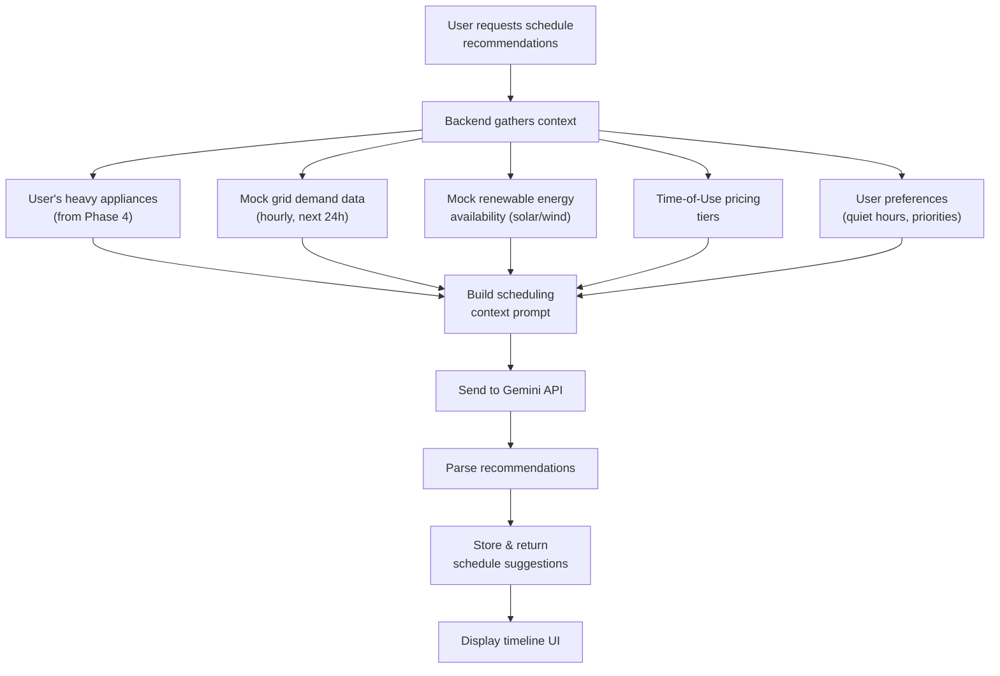

# 06 — Smart Scheduling Engine (Gemini)

> **Phase 6** | Estimated Effort: 3–4 days
> **Goal:** Build an AI-powered scheduling system that recommends optimal times to run heavy appliances based on mock grid demand data, renewable energy availability, and time-of-use pricing — using Google Gemini for intelligent reasoning.

---

## 1. Objectives

- [ ] Create mock data models for energy grid demand, renewable energy availability, and TOU pricing.
- [ ] Build the scheduling context assembler that gathers all relevant data.
- [ ] Design the Gemini prompt for scheduling recommendations.
- [ ] Implement the scheduling API endpoints.
- [ ] Build the scheduling UI with a timeline/calendar view.
- [ ] Allow users to accept/dismiss recommendations and track adherence.

---

## 2. System Overview



---

## 3. Mock Data Models

### 3.1 Grid Demand Data

Simulates the local energy grid's hourly demand level (affects pricing and carbon intensity).

```
GridDemand:
  hour: int (0-23)
  demand_level: enum ["low", "medium", "high", "peak"]
  load_percentage: float (0-100, % of grid capacity)
  carbon_intensity_gco2_kwh: float (grams CO₂ per kWh)
```

**Typical Daily Pattern:**
| Hour | Demand | Load % | Carbon Intensity | Rationale |
|---|---|---|---|---|
| 0–5 | Low | 30–40% | 200 | Overnight, minimal usage |
| 6–8 | Medium | 50–65% | 350 | Morning ramp-up |
| 9–11 | Medium | 60–70% | 380 | Business hours begin |
| 12–14 | High | 75–85% | 420 | Midday peak (commercial) |
| 15–17 | High | 80–90% | 450 | Afternoon industrial load |
| 17–20 | **Peak** | **90–100%** | **500** | **Evening peak (residential + commercial)** |
| 21–23 | Medium | 55–65% | 320 | Evening wind-down |

### 3.2 Renewable Energy Availability

Simulates solar and wind energy contribution to the grid.

```
RenewableAvailability:
  hour: int (0-23)
  solar_percentage: float (0-100, % of grid from solar)
  wind_percentage: float (0-100, % of grid from wind)
  total_renewable_percentage: float
  is_green_peak: bool (total_renewable > 40%)
```

**Typical Pattern (Summer):**
| Hour | Solar % | Wind % | Total Renewable | Green Peak? |
|---|---|---|---|---|
| 0–5 | 0 | 15 | 15% | No |
| 6–8 | 10 | 12 | 22% | No |
| 9–11 | 35 | 10 | 45% | ✅ Yes |
| 12–14 | **50** | 8 | **58%** | ✅ **Yes** |
| 15–17 | 30 | 12 | 42% | ✅ Yes |
| 18–20 | 5 | 18 | 23% | No |
| 21–23 | 0 | 20 | 20% | No |

### 3.3 Time-of-Use (TOU) Pricing

```
PricingTier:
  tier_name: enum ["off_peak", "mid_peak", "on_peak"]
  hours: list[int]
  rate_per_kwh: float (USD)
  color: str (for UI)
```

**Default TOU Schedule:**
| Tier | Hours | Rate ($/kWh) | Color |
|---|---|---|---|
| Off-Peak | 11 PM – 7 AM | $0.08 | 🟢 Green |
| Mid-Peak | 7 AM – 4 PM, 9 PM – 11 PM | $0.12 | 🟡 Yellow |
| On-Peak | 4 PM – 9 PM | $0.22 | 🔴 Red |

---

## 4. Scheduling Context Assembly

### 4.1 What Data Goes into the Prompt

Before calling Gemini, the backend assembles a **context object** with:

1. **User's schedulable appliances** (heavy appliances only):
   - Name, active wattage, typical run duration
   - Example: Washing Machine (500W, ~60 min), Dishwasher (1800W, ~90 min), Clothes Dryer (3000W, ~45 min), EV Charger (if applicable)

2. **Next 24 hours of grid data:**
   - Hourly demand levels
   - Carbon intensity per hour
   - Renewable energy percentages

3. **TOU pricing schedule:**
   - Rate per hour for the next 24 hours

4. **User preferences:**
   - Quiet hours (e.g., 10 PM – 7 AM, no noisy appliances)
   - Priority: "save_money" | "reduce_carbon" | "balanced"
   - Any blocked time slots

5. **Current date and day of week** (for weekend patterns)

### 4.2 Context Schema

```
SchedulingContext:
  appliances: [
    { name: str, watts: int, typical_duration_minutes: int, is_noisy: bool }
  ]
  grid_forecast: [
    { hour: int, demand: str, carbon_gco2: float, renewable_pct: float, rate_usd: float }
  ]
  user_preferences:
    priority: "save_money" | "reduce_carbon" | "balanced"
    quiet_hours: { start: int, end: int }
    blocked_slots: [ { start: int, end: int } ]
  date: str
  day_of_week: str
```

---

## 5. Gemini Prompt Design

### 5.1 Scheduling Prompt

```
You are an expert energy optimization advisor for smart homes.

Given the following household data, recommend the best time slots to run
each appliance over the next 24 hours.

CONTEXT:
{scheduling_context_json}

OPTIMIZATION GOALS (priority: {user_priority}):
- save_money: Minimize electricity cost by scheduling during off-peak rates.
- reduce_carbon: Minimize carbon footprint by scheduling during high renewable energy periods.
- balanced: Optimize for both cost savings and carbon reduction.

CONSTRAINTS:
- Noisy appliances must NOT be scheduled during quiet hours ({quiet_start}:00 - {quiet_end}:00).
- Do not schedule multiple high-wattage appliances (>1500W) in the same time slot.
- Each appliance should be scheduled once unless the user has multiple loads.
- Respect any blocked time slots.

Respond ONLY with valid JSON in this exact format:
{
  "recommendations": [
    {
      "appliance": "appliance name",
      "recommended_start": "HH:MM (24-hour format)",
      "recommended_end": "HH:MM",
      "estimated_cost": number (USD for this run),
      "carbon_saved_vs_peak": number (grams CO₂ saved compared to running at peak),
      "money_saved_vs_peak": number (USD saved compared to running at peak),
      "renewable_percentage": number (% renewable energy during this slot),
      "reasoning": "Brief explanation of why this time was chosen",
      "priority_rank": number (1 = most impactful to schedule at this time)
    }
  ],
  "daily_summary": {
    "total_estimated_cost": number,
    "total_carbon_saved": number,
    "best_renewable_window": "HH:MM - HH:MM",
    "tip": "A practical energy-saving tip for today"
  }
}
```

---

## 6. API Endpoints

### 6.1 Scheduling Endpoints

| Method | Endpoint | Purpose |
|---|---|---|
| GET | `/api/v1/schedule/recommendations` | Get AI-generated schedule for next 24h |
| GET | `/api/v1/schedule/grid-forecast` | Get mock grid data for next 24h (for UI chart) |
| POST | `/api/v1/schedule/accept/{rec_id}` | Accept a recommendation |
| POST | `/api/v1/schedule/dismiss/{rec_id}` | Dismiss a recommendation |
| GET | `/api/v1/schedule/history` | Past accepted schedules |
| PUT | `/api/v1/schedule/preferences` | Update scheduling preferences |

### 6.2 Preferences Schema

```
SchedulePreferences:
  priority: enum ["save_money", "reduce_carbon", "balanced"] (default: "balanced")
  quiet_hours_start: int (0-23, default: 22)
  quiet_hours_end: int (0-23, default: 7)
  blocked_slots: [ { start_hour: int, end_hour: int, reason: str } ]
  auto_schedule: bool (future: automatically trigger smart plugs)
```

### 6.3 Recommendation Response Schema

```
ScheduleRecommendation:
  id: UUID
  appliance_id: UUID
  appliance_name: str
  recommended_start: str (HH:MM)
  recommended_end: str (HH:MM)
  estimated_cost_usd: float
  carbon_saved_grams: float
  money_saved_usd: float
  renewable_percentage: float
  reasoning: str
  priority_rank: int
  status: enum ["pending", "accepted", "dismissed", "completed"]
  created_at: datetime
```

---

## 7. Frontend: Scheduling UI

### 7.1 Scheduler Page Layout

```
┌────────────────────────────────────────────────────────┐
│  📅 Smart Scheduler                                     │
│                                                         │
│  Priority: [💰 Save Money] [🌱 Reduce Carbon] [⚖️ Both] │
│                                                         │
│  ┌────────────────────────────────────────────────────┐ │
│  │  24-HOUR TIMELINE                                  │ │
│  │  ┌──┬──┬──┬──┬──┬──┬──┬──┬──┬──┬──┬──┐           │ │
│  │  │12│ 2│ 4│ 6│ 8│10│12│ 2│ 4│ 6│ 8│10│  AM/PM    │ │
│  │  ├──┴──┴──┴──┴──┴──┴──┴──┴──┴──┴──┴──┤           │ │
│  │  │🟢🟢🟢🟢│🟡🟡🟡│🟡🟡🟡🟡│🔴🔴🔴│🟡🟡│           │ │
│  │  │off-peak │mid    │mid-peak│on-peak│mid │ Pricing  │ │
│  │  ├──────────────────────────────────────┤           │ │
│  │  │░░░░░░│▓▓▓▓▓▓▓▓▓▓▓▓│░░░░░░│░░░░░░│  │ Solar    │ │
│  │  ├──────────────────────────────────────┤           │ │
│  │  │  🧺 Wash │    🍽️ Dish  │            │  Schedule │ │
│  │  │  2-3 AM  │   10-11:30  │            │           │ │
│  │  └──────────────────────────────────────┘           │ │
│  └────────────────────────────────────────────────────┘ │
│                                                         │
│  📋 RECOMMENDATIONS                                     │
│  ┌────────────────────────────────────────────────────┐ │
│  │ 🧺 Washing Machine                          Rank #1│ │
│  │ Best time: 2:00 AM - 3:00 AM                       │ │
│  │ 💰 Save $0.14  🌱 Save 180g CO₂  ♻️ 15% renewable │ │
│  │ "Off-peak pricing + low grid demand"                │ │
│  │ [ ✅ Accept ] [ ❌ Dismiss ]                        │ │
│  └────────────────────────────────────────────────────┘ │
│  ┌────────────────────────────────────────────────────┐ │
│  │ 🍽️ Dishwasher                               Rank #2│ │
│  │ Best time: 10:00 AM - 11:30 AM                     │ │
│  │ 💰 Save $0.09  🌱 Save 320g CO₂  ♻️ 45% renewable │ │
│  │ "Solar peak — maximum renewable energy"             │ │
│  │ [ ✅ Accept ] [ ❌ Dismiss ]                        │ │
│  └────────────────────────────────────────────────────┘ │
│                                                         │
│  📊 Today's Summary                                     │
│  Total estimated cost: $0.42 | Carbon saved: 500g      │
│  Best renewable window: 10 AM - 2 PM (58% renewable)   │
└────────────────────────────────────────────────────────┘
```

### 7.2 Timeline Component

A horizontal timeline visualization showing:
- **Pricing tiers** as colored bands (green/yellow/red).
- **Renewable energy** as a filled area chart overlay.
- **Scheduled appliances** as blocks placed on the timeline.
- **Current time** as a vertical line marker.
- Interactive: hover to see hour details, click to see full info.

### 7.3 Recommendation Card Component

`ScheduleCard.vue`:
- Appliance name and icon
- Recommended time window
- Three key metrics: cost savings, carbon savings, renewable %
- AI reasoning text (collapsible)
- Accept / Dismiss buttons
- Animation on accept (card slides to "Accepted" section)

---

## 8. Backend Implementation Details

### 8.1 Service: `schedule_service.py`

```
class ScheduleService:
    Methods:
    - generate_recommendations(user_id) → list[ScheduleRecommendation]
      1. Fetch user's heavy appliances (watts > 500)
      2. Generate/fetch mock grid forecast for next 24h
      3. Fetch user's scheduling preferences
      4. Assemble context prompt
      5. Call Gemini API
      6. Parse and validate response
      7. Store recommendations in DB
      8. Return sorted by priority_rank

    - accept_recommendation(user_id, rec_id) → ScheduleRecommendation
      Update status to "accepted"

    - dismiss_recommendation(user_id, rec_id) → ScheduleRecommendation
      Update status to "dismissed"

    - get_grid_forecast(hours=24) → list[GridForecast]
      Generate or return cached mock grid data

    - calculate_savings(appliance, recommended_hour, peak_hour) → SavingsBreakdown
      Compute cost and carbon savings vs. worst-case timing
```

### 8.2 Mock Grid Data Generator

```
def generate_grid_forecast(hours: int = 24) -> list[dict]:
    """
    Generates realistic mock grid data starting from the current hour.

    For each hour:
    - Base demand follows the pattern in section 3.1
    - Add ±5% random variance
    - Solar follows a bell curve peaking at noon
    - Wind is semi-random with slight nighttime increase
    - Carbon intensity inversely correlates with renewable %
    - TOU rate determined by hour of day

    Returns list of hourly forecasts.
    """
```

### 8.3 Caching Recommendations

- Cache Gemini scheduling responses for **6 hours** (grid data doesn't change that fast in mock).
- If user changes preferences, invalidate cache and regenerate.
- Store a `last_generated_at` timestamp to know when to refresh.

---

## 9. Savings Calculations

### 9.1 Cost Savings

```
cost_at_recommended_time = (appliance_watts / 1000) × duration_hours × rate_at_recommended_hour
cost_at_peak_time = (appliance_watts / 1000) × duration_hours × peak_rate
money_saved = cost_at_peak_time - cost_at_recommended_time
```

### 9.2 Carbon Savings

```
carbon_at_recommended = (appliance_watts / 1000) × duration_hours × carbon_intensity_at_hour
carbon_at_peak = (appliance_watts / 1000) × duration_hours × peak_carbon_intensity
carbon_saved = carbon_at_peak - carbon_at_recommended
```

---

## 10. Green Score Integration

- **Schedule adherence factor** (5% of total score).
- Track: recommendations accepted / total recommendations generated.
- A user who consistently accepts and follows recommendations gets a higher adherence score.

---

## 11. Edge Cases

| Scenario | Handling |
|---|---|
| No heavy appliances registered | Show "Add appliances to get scheduling recommendations" |
| User blocks all available time slots | Return error: "No available time slots. Please adjust your preferences." |
| Gemini returns overlapping schedules | Backend validation: check for conflicts and adjust |
| All hours are on-peak (unusual scenario) | Still recommend the least-bad option with honest savings calculation |
| User is in a different timezone | Store user timezone in profile, convert all times accordingly |
| Recommendations requested too frequently | Rate limit: max 1 generation per 6 hours (return cached otherwise) |
| Weekend vs weekday patterns | Pass day_of_week to Gemini for context-aware recommendations |

---

## 12. Dependencies

| Dependency | Direction |
|---|---|
| **Phase 1** (Setup) | ← Project structure |
| **Phase 2** (Auth) | ← User authentication |
| **Phase 4** (IoT Data) | ← Appliance data (wattage, categories) |
| **Phase 3** (Dashboard) | → Summary data feeds into dashboard |
| Gemini API key | ← Must be configured |

---

> **Next:** Proceed to [07_challenges_and_gamification.md](./07_challenges_and_gamification.md) to build the sustainability challenges and gamification system.
