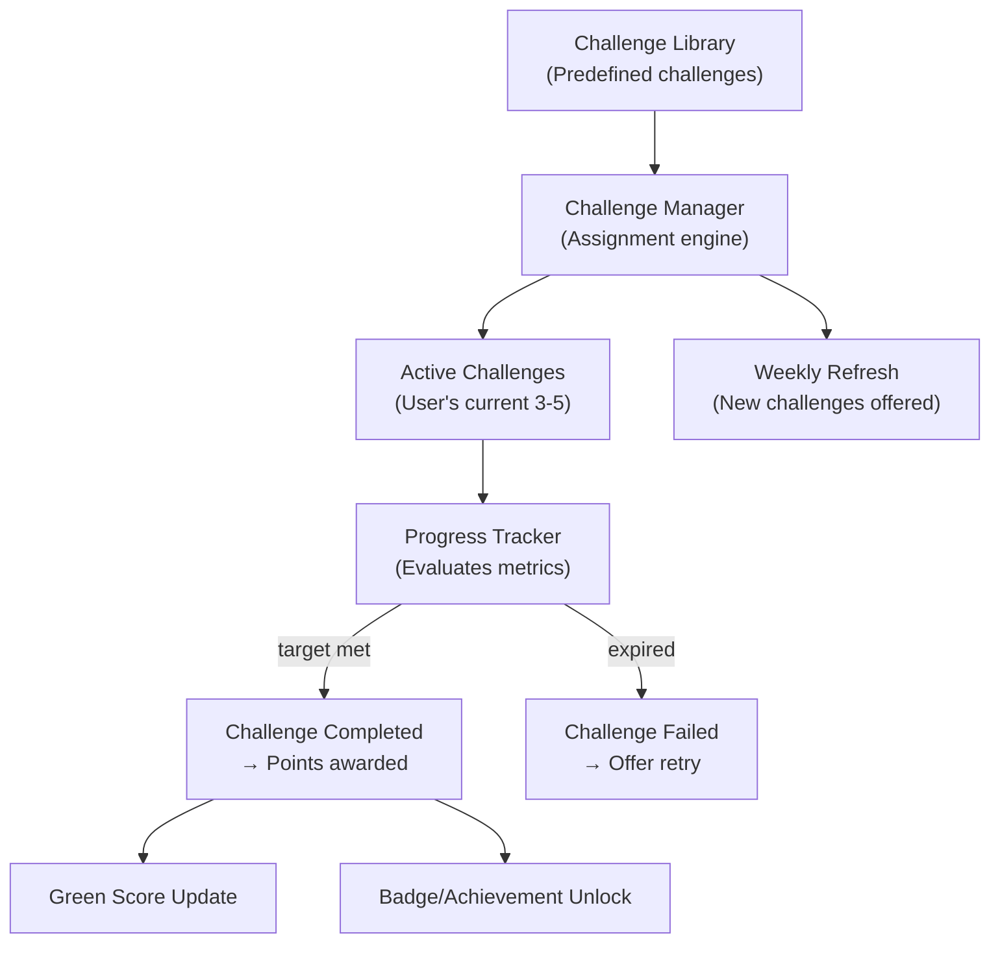
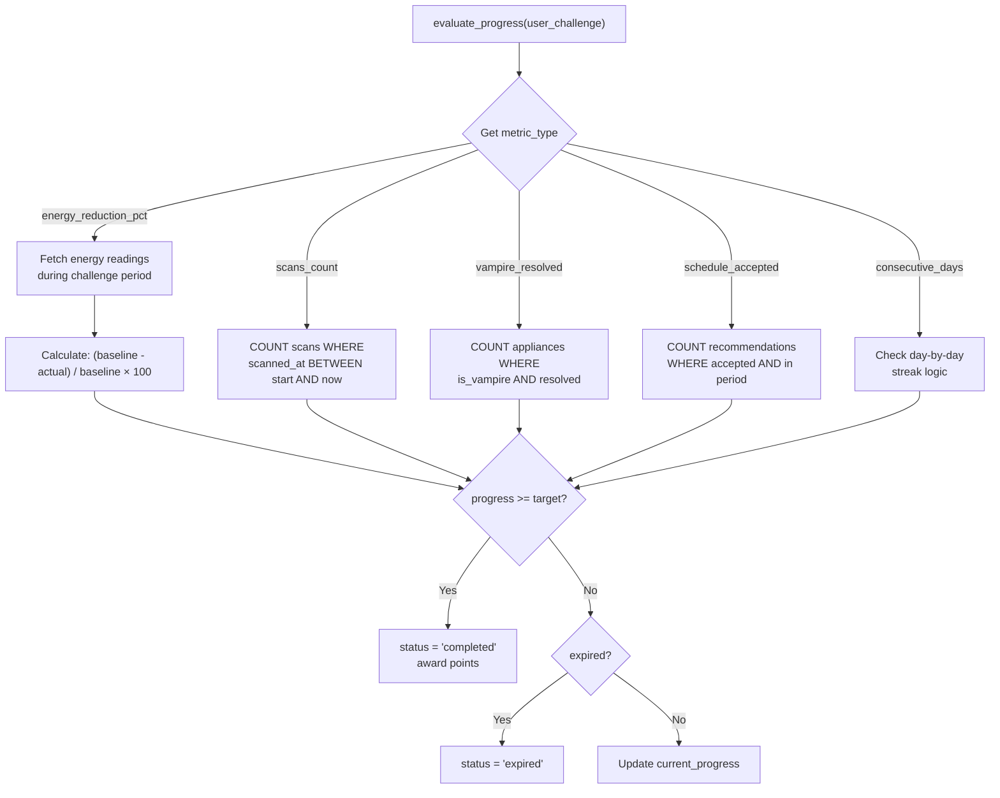

# 07 — Challenges & Gamification

> **Phase 7** | Estimated Effort: 2–3 days
> **Goal:** Build a sustainability challenge system with predefined challenges, progress tracking, point rewards, and streak mechanics to drive long-term user engagement.

---

## 1. Objectives

- [ ] Design a library of predefined sustainability challenges across multiple categories.
- [ ] Build the challenge assignment and progress tracking engine.
- [ ] Implement the challenges API endpoints.
- [ ] Create the challenges UI with progress cards, leaderboard, and achievement badges.
- [ ] Integrate challenge completion into the Green Score calculation.

---

## 2. Challenge System Overview



---

## 3. Challenge Data Model

### 3.1 Challenge Template (Library)

```
Challenge:
  id: UUID PK
  title: str
  description: str (detailed explanation)
  short_description: str (one-liner for cards)
  category: enum ["energy", "water", "waste", "lifestyle", "learning"]
  difficulty: enum ["easy", "medium", "hard"]
  metric_type: enum (see below)
  target_value: float (what the user needs to achieve)
  target_unit: str (e.g., "kWh", "liters", "%", "scans")
  comparison: enum ["less_than", "greater_than", "equal_to"]
  duration_days: int (how long the user has)
  points: int (reward for completion)
  icon: str (emoji)
  is_active: bool (admin can disable challenges)
  created_at: datetime
```

### 3.2 User Challenge (Active/Completed)

```
UserChallenge:
  id: UUID PK
  user_id: UUID FK
  challenge_id: UUID FK
  current_progress: float
  target_value: float (copied from challenge at assignment time)
  status: enum ["active", "completed", "failed", "expired"]
  started_at: datetime
  expires_at: datetime
  completed_at: datetime (nullable)
  points_earned: int (0 if not completed)
```

### 3.3 Metric Types

| Metric Type | What It Measures | How Progress Is Calculated |
|---|---|---|
| `energy_reduction_pct` | % reduction in kWh vs. baseline | `(baseline - current) / baseline × 100` |
| `energy_absolute_kwh` | Total kWh consumed in period | `SUM(kwh) over challenge duration` |
| `water_reduction_pct` | % reduction in water vs. baseline | Same formula as energy |
| `water_absolute_liters` | Total liters consumed | `SUM(liters) over challenge duration` |
| `scans_count` | Number of items scanned | `COUNT(scans) where scanned_at in range` |
| `vampire_resolved` | Energy vampires addressed | `COUNT(vampires where resolved=true)` |
| `schedule_accepted` | Schedule recommendations accepted | `COUNT(recommendations where accepted)` |
| `consecutive_days` | Days in a row meeting a target | Custom streak counter |

---

## 4. Predefined Challenge Library

### 4.1 Energy Challenges

| Title | Difficulty | Target | Duration | Points | Icon |
|---|---|---|---|---|---|
| "Cut the Power" | Easy | Reduce electricity by 5% | 7 days | 50 | ⚡ |
| "Energy Diet" | Medium | Reduce electricity by 10% | 7 days | 100 | 🔌 |
| "Blackout Champion" | Hard | Reduce electricity by 20% | 14 days | 250 | 🏆 |
| "Vampire Slayer" | Easy | Resolve 3 energy vampires | 7 days | 75 | 🧛 |
| "Vampire Hunter" | Medium | Resolve all energy vampires | 14 days | 200 | 🗡️ |
| "Peak Dodger" | Medium | Accept 5 schedule recommendations | 7 days | 100 | ⏰ |

### 4.2 Water Challenges

| Title | Difficulty | Target | Duration | Points | Icon |
|---|---|---|---|---|---|
| "Water Wise" | Easy | Reduce water by 5% | 7 days | 50 | 💧 |
| "Drought Mode" | Medium | Reduce water by 15% | 7 days | 120 | 🏜️ |
| "5-Minute Showers" | Easy | Keep daily shower water under 40L | 7 days | 75 | 🚿 |

### 4.3 Waste & Scanning Challenges

| Title | Difficulty | Target | Duration | Points | Icon |
|---|---|---|---|---|---|
| "Scan Master" | Easy | Scan 5 items for recycling | 7 days | 50 | 📸 |
| "Recycling Pro" | Medium | Scan 15 items for recycling | 14 days | 150 | ♻️ |
| "Zero Waste Week" | Hard | Scan every purchase for a week | 7 days | 200 | 🌍 |

### 4.4 Lifestyle Challenges

| Title | Difficulty | Target | Duration | Points | Icon |
|---|---|---|---|---|---|
| "Green Streak" | Easy | Maintain Green Score > 60 for 5 days | 5 days | 75 | 🔥 |
| "Eco Warrior" | Hard | Maintain Green Score > 80 for 14 days | 14 days | 300 | 🛡️ |
| "Smart Scheduler" | Medium | Accept all schedule recommendations for a week | 7 days | 125 | 📅 |

---

## 5. Challenge Manager Service

### 5.1 Service: `challenge_service.py`

```
class ChallengeService:
    Methods:

    - get_available_challenges(user_id) → list[Challenge]
      Returns challenges the user hasn't completed recently
      and isn't currently attempting.

    - assign_challenge(user_id, challenge_id) → UserChallenge
      Creates a new UserChallenge with status="active",
      sets expires_at based on duration_days.

    - evaluate_progress(user_id, user_challenge_id) → ProgressUpdate
      Calculates current progress based on metric_type:
      - Queries the relevant data source (energy readings, scans, etc.)
      - Compares against the target value
      - Updates current_progress
      - If target met → mark as "completed", award points
      - If expired → mark as "expired"

    - get_active_challenges(user_id) → list[UserChallengeWithProgress]
      Returns all active challenges with current progress.

    - evaluate_all_active(user_id)
      Batch evaluate all active challenges for a user.
      Called on dashboard load or via periodic job.

    - suggest_challenges(user_id) → list[Challenge]
      Recommends 3 new challenges based on:
      - User's weakest areas (lowest Green Score factors)
      - Previously completed challenges (don't repeat too soon)
      - Progressive difficulty (start easy, ramp up)
```

### 5.2 Progress Evaluation Logic



---

## 6. API Endpoints

| Method | Endpoint | Purpose |
|---|---|---|
| GET | `/api/v1/challenges/available` | List challenges the user can start |
| GET | `/api/v1/challenges/active` | List user's active challenges with progress |
| GET | `/api/v1/challenges/completed` | List user's completed challenges |
| POST | `/api/v1/challenges/{challenge_id}/start` | Start a challenge |
| GET | `/api/v1/challenges/{user_challenge_id}/progress` | Get detailed progress |
| POST | `/api/v1/challenges/{user_challenge_id}/abandon` | Abandon an active challenge |
| GET | `/api/v1/challenges/suggested` | Get AI-suggested challenges |
| GET | `/api/v1/challenges/stats` | Get overall challenge stats (total points, completion rate) |

---

## 7. Frontend: Challenges UI

### 7.1 Challenges Page Layout

```
┌────────────────────────────────────────────────────────┐
│  🏆 Sustainability Challenges                          │
│                                                         │
│  Your Points: 475 🌟  |  Completed: 7  |  Streak: 3 🔥│
│                                                         │
│  ── Active Challenges (2/3) ──────────────────────────  │
│                                                         │
│  ┌──────────────────────┐  ┌──────────────────────┐    │
│  │ ⚡ Energy Diet        │  │ 📸 Scan Master       │    │
│  │ Reduce electricity   │  │ Scan 5 items for    │    │
│  │ by 10% this week     │  │ recycling this week │    │
│  │                      │  │                      │    │
│  │ ████████░░░░ 72%     │  │ ██████░░░░░░ 60%    │    │
│  │ 7.2/10% reduced      │  │ 3/5 items scanned   │    │
│  │                      │  │                      │    │
│  │ ⏰ 3 days left        │  │ ⏰ 5 days left       │    │
│  │ 🌟 100 points         │  │ 🌟 50 points         │    │
│  └──────────────────────┘  └──────────────────────┘    │
│                                                         │
│  [ + Start New Challenge ]                              │
│                                                         │
│  ── Suggested For You ────────────────────────────────  │
│                                                         │
│  ┌──────────────────────┐  ┌──────────────────────┐    │
│  │ 🧛 Vampire Slayer     │  │ 💧 Water Wise        │    │
│  │ Resolve 3 energy     │  │ Reduce water by 5%  │    │
│  │ vampires — 7 days    │  │ this week            │    │
│  │ 🌟 75 pts | Easy      │  │ 🌟 50 pts | Easy     │    │
│  │ [ Start Challenge ]   │  │ [ Start Challenge ]  │    │
│  └──────────────────────┘  └──────────────────────┘    │
│                                                         │
│  ── Completed ────────────────────────────────────────  │
│  ✅ Cut the Power (50pts) | ✅ Green Streak (75pts)    │
│  ✅ 5-Minute Showers (75pts) | ...                     │
└────────────────────────────────────────────────────────┘
```

### 7.2 Challenge Card Component (`ChallengeCard.vue`)

- **Icon** and **title** (prominent)
- **Description** (1–2 lines)
- **Progress bar** with percentage and current/target values
- **Time remaining** (countdown or "X days left")
- **Points reward** badge
- **Difficulty indicator** (Easy/Medium/Hard with color coding)
- **Status-specific actions:**
  - Available: "Start Challenge" button
  - Active: Progress bar, "Abandon" option (with confirmation)
  - Completed: Checkmark, points earned, completion date
  - Expired: "Try Again" button

### 7.3 Points & Stats Section

Display at the top of the page:
- **Total points** earned (all time)
- **Challenges completed** count
- **Current streak** (consecutive weeks with at least one completion)
- **Completion rate** (completed / total attempted)

---

## 8. Notification System (Lightweight)

For the MVP, implement simple in-app notifications (no push notifications):

| Event | Notification |
|---|---|
| Challenge 75% complete | "Almost there! You're 75% of the way to completing 'Energy Diet'!" |
| Challenge completed | "🎉 Challenge complete! You earned 100 points!" |
| Challenge expiring (1 day left) | "⏰ 'Scan Master' expires tomorrow. You're at 60%!" |
| New challenges available | "📋 New weekly challenges are available!" |

**Implementation:** Store notifications in a `notifications` table, display as a toast/bell icon badge.

---

## 9. Green Score Integration

- **Challenge completion factor** (20% of Green Score)
- Calculation: `completed_this_period / available_this_period`
- Period: rolling 30 days
- A user who completes 3/5 available challenges scores 0.6 × 20% = 12 points on the Green Score.

---

## 10. Points Economy

### 10.1 Points Value

Points serve as a gamification currency. For the MVP, they are **display-only** (no redemption system):

| Level | Points Required | Title |
|---|---|---|
| 1 | 0 | Seedling 🌱 |
| 2 | 100 | Sprout 🌿 |
| 3 | 300 | Sapling 🌳 |
| 4 | 600 | Tree 🌲 |
| 5 | 1000 | Forest 🏔️ |
| 6 | 1500 | Ecosystem 🌍 |
| 7 | 2500 | Guardian 🛡️ |
| 8 | 4000 | Champion 🏆 |
| 9 | 6000 | Legend ⭐ |
| 10 | 10000 | Planet Saver 🌟 |

### 10.2 Level Display

Show the user's level prominently in the sidebar and dashboard:
- Level badge with icon
- Points progress bar to next level
- "X points to next level" text

---

## 11. Challenge Refresh Cycle

- New challenges are suggested **weekly** (every Monday at midnight UTC).
- Users can have a **maximum of 3 active challenges** at any time.
- Completed challenges enter a **14-day cooldown** before they can be retaken.
- Expired challenges can be retried immediately.

---

## 12. Edge Cases

| Scenario | Handling |
|---|---|
| User tries to start > 3 challenges | Return 400: "Maximum 3 active challenges. Complete or abandon one first." |
| Challenge references metric with no data | Show "Insufficient data — complete Phase X setup first" |
| User abandons a challenge | No penalty to Green Score, but no points either |
| Challenge expires while user is offline | Auto-expire on next login, show notification |
| Baseline not established for % challenges | Defer % challenges until baseline period (7 days) is complete |
| Two challenges conflict (reduce energy + increase scans are fine; two energy reduction challenges would conflict) | Backend prevents conflicting challenge assignment |

---

## 13. Testing Checklist

| Test | Method |
|---|---|
| Challenge assignment creates correct UserChallenge | Unit test |
| Progress evaluation calculates correctly for each metric type | Unit test (parametrized) |
| Challenge completes when target is met | Integration test |
| Challenge expires when duration passes | Integration test |
| Points are awarded on completion | Integration test |
| Max 3 active challenges enforced | API test |
| Cooldown period prevents re-assignment | API test |
| Challenge cards render correctly in all states | Manual UI test |

---

## 14. Dependencies

| Dependency | Direction |
|---|---|
| **Phase 2** (Auth) | ← User authentication |
| **Phase 3** (Dashboard) | → Challenge preview on dashboard |
| **Phase 4** (IoT Data) | ← Energy/water data for progress evaluation |
| **Phase 5** (Scanner) | ← Scan count for scan-based challenges |
| **Phase 6** (Scheduling) | ← Recommendation acceptance for schedule challenges |

---

> **Next:** Proceed to [08_deployment_and_ci_cd.md](./08_deployment_and_ci_cd.md) to configure deployment pipelines for Vercel and Render.
